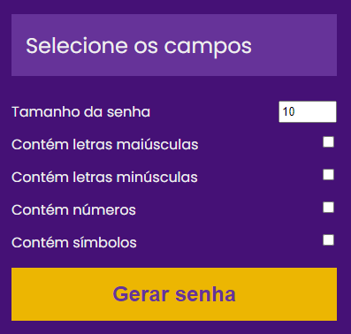

# Gerador de senha

## Aplicação que gera uma senha aleatória

Feito em HTML, CSS e JavaScript, essa aplicação gera uma senha com no mínimo 8 caracteres, podendo conter letras maiúsculas, minúsculas, números e caracteres especiais ( ~!@#$%^&*()_+=| ) de acordo
com o padrão escolhido.

Caso queira acessar diretamente [clique aqui.](https://giovanef16-sys.github.io/Gerador-de-Senha/)

## Instalação

Como foi desenvolvido de forma simples, a sua utilização também é facilitada
1. Faça o clone do repositório em uma pasta local
        
        git clone https://github.com/giovanef16-sys/Gerador-de-Senha.git
2. Abra o arquivo **index.html** com o seu navegador

### Imagem da aplicação

